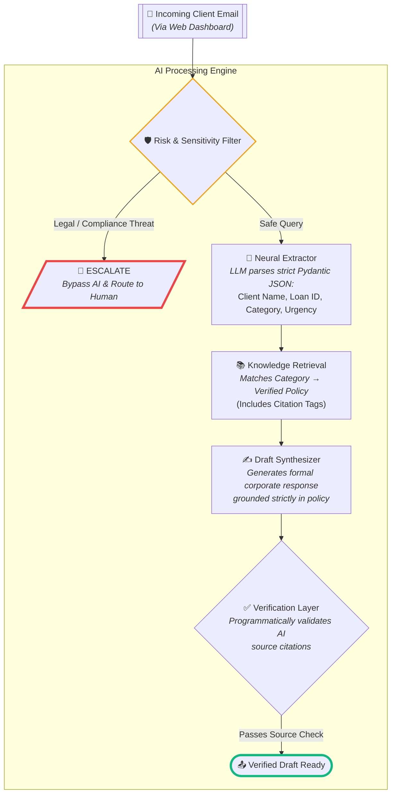

# FinServe AI Email Triage Engine

**Submission for:** 10Clouds Financial Institutions Assessment Task (Step 2: Proof-of-concept Implementation)  
**Candidate:** Salih Furkan Erik

An enterprise-grade, proof-of-concept AI system that automates client support email processing for **FinServe**, a mid-size financial services company.

## Context & Problem Statement

As part of the FinServe scenario, the Client Support department (10 staff) handles enquiries, complaints, and after-sales issues manually via email, phone, and a client portal. They lack a shared knowledge base or standard responses, leading to:

- **Inconsistent replies** — different agents give different answers to the same question
- **Slow response times** — agents must manually look up policies for each enquiry
- **No audit trail** — no way to verify responses were policy-compliant
- **Compliance risk** — sensitive legal matters may not be escalated properly

## The Solution (PoC)

An AI-powered email triage engine featuring a premium **Glassmorphism web dashboard**, a **Retrieval-Augmented pipeline**, and a **"skeptical" verification layer**:



### Key Design Decisions

- **Sensitivity filter runs first** — legal/compliance emails never reach the LLM; they are immediately escalated to a human agent.
- **Structured extraction via Pydantic** — the LLM output is validated against a strict schema, ensuring data integrity.
- **Source verification** — the engine programmatically checks that the AI draft cites the correct policy source, catching hallucinations.
- **Audit trail** — every processed email generates a timestamped record of what policy was used and whether verification passed.

## Setup

### Prerequisites

- Python 3.10+
- A [Groq API key](https://console.groq.com/) (free tier available)

### Installation

```bash
pip install -r requirements.txt
```

### Configuration

Create a `.env` file in the project root:

```
GROQ_API_KEY=your-groq-api-key-here
```

### Run

```bash
python app.py
```

This will launch the local **Gradio Dashboard** in your browser at `http://127.0.0.1:7860`. From the interactive UI, you can select the 4 demo scenarios (document request, loan status, billing, and a legal escalation) or type your own custom emails to see the pipeline process them in real-time.

## Tech Stack

| Component | Technology |
|-----------|-----------|
| LLM | Llama 3.3 70B via Groq |
| LLM Abstraction | LiteLLM (provider-agnostic) |
| Data Validation | Pydantic V2 |
| Configuration | python-dotenv |

## Future Improvements

- **Full RAG pipeline** — Replace the static knowledge base with vector search over actual policy documents
- **Email integration** — Connect to IMAP/SMTP for real inbox monitoring
- **Human-in-the-loop** — Build a review queue where agents approve/edit AI drafts before sending
- **Analytics dashboard** — Track category distribution, response times, and verification pass rates
